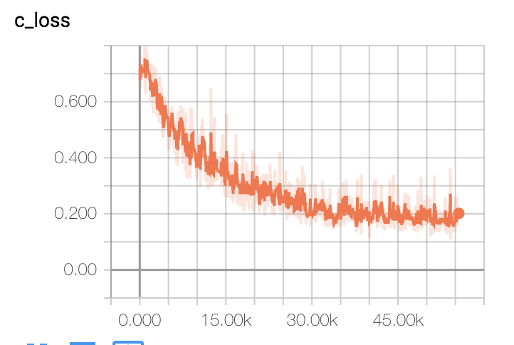
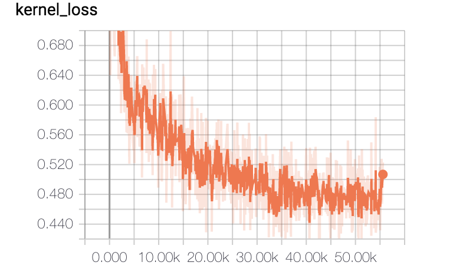
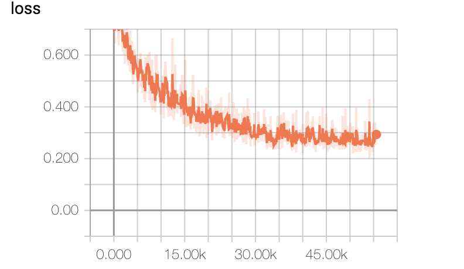

# Shape Robust Text Detection with Progressive Scale Expansion Network

## Requirements

- Python 2.7

- mxnet1.4.0

- pyclipper

- Polygon2

- OpenCV 3+ (for c++ version pse)
- TensorboardX

## Introduction

Progressive Scale Expansion Network (PSENet) is a text detector which is able to well detect the arbitrary-shape text in natural scene.


## Usage  

### Pretrained-models

- [gluoncv_model_zoo](https://gluon-cv.mxnet.io/model_zoo/classification.html):**resnet50_v1b**, you can replace it with others，the default path of pretrained-model in `~/.mxnet/`

### Train  

```
python scripts/train.py $data_path $ckpt
```
- `data_path`: path of dataset, which the prefix of image and annoation must be same, for example, a.jpg, a.txt  
- `ckpt`: the filename of pretrained-mdel  

#### loss curve as follow:

|  |  |  |
| :-------------------------------------: | :-------------------------------------: | :-------------------------------------: |
|                Text loss                |               Kernel loss               |                All_loss                 |

### Inference  

```
python scripts/eval.py $data_path $ckpt
```
Now the poster is in python version, I will add c++ poster into this repo


### TODO

- [ ] Evaluation
- [ ] Integrate C++ into Repo

### References  

- [issue 15](https://github.com/whai362/PSENet/issues/15), 
- [tensorflow_PSENET](https://github.com/liuheng92/tensorflow_PSENet) 
- [issue10](https://github.com/whai362/PSENet/issues/10)
- [PSENet](https://github.com/whai362/PSENet)

